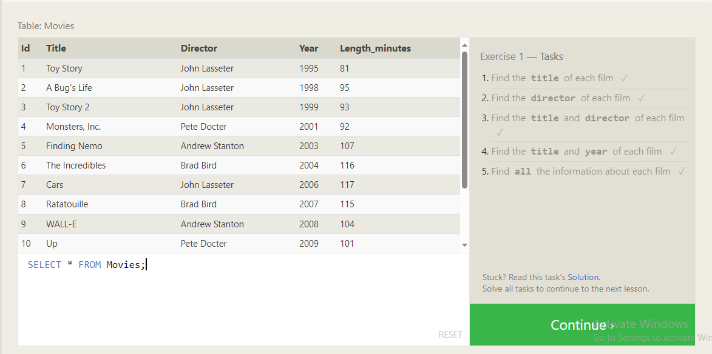
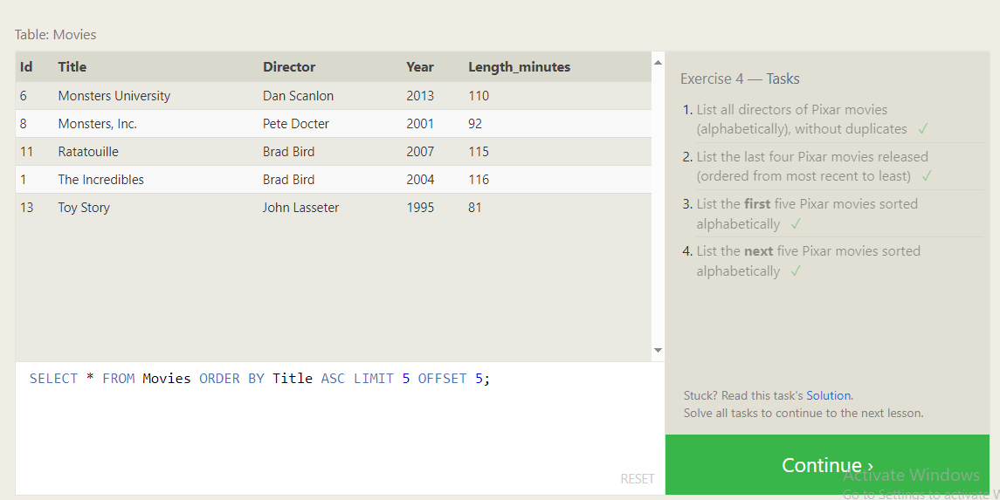
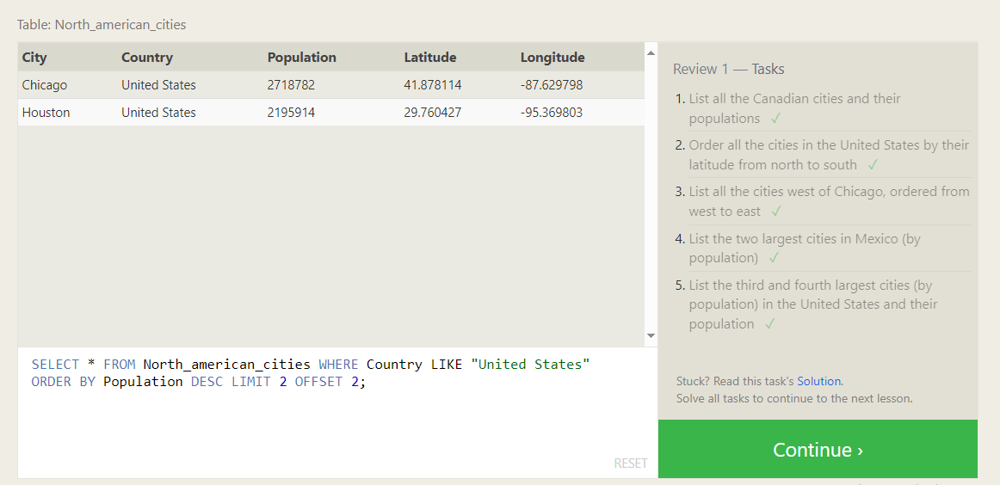
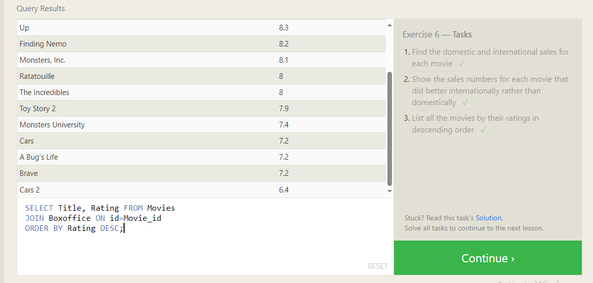
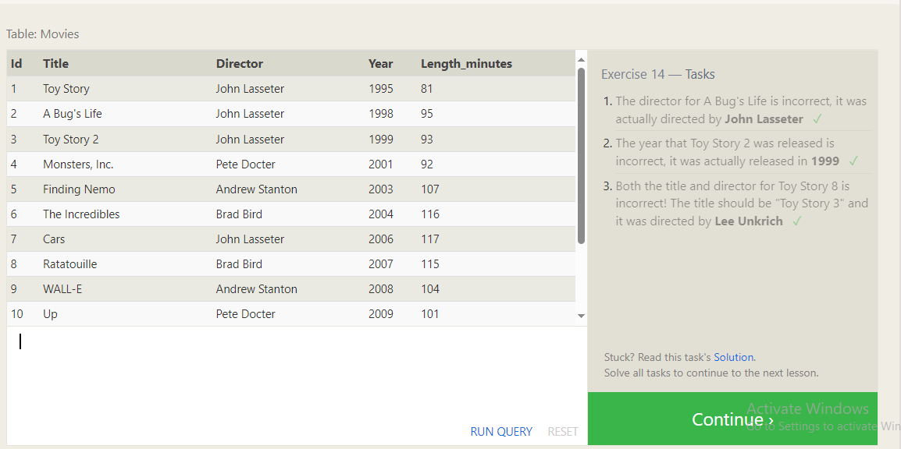
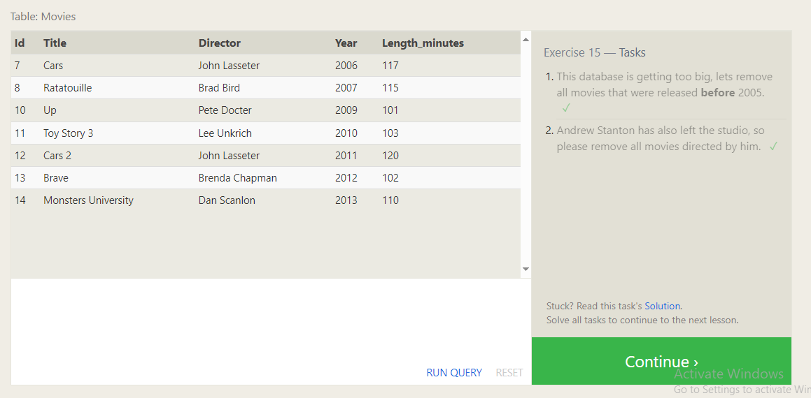
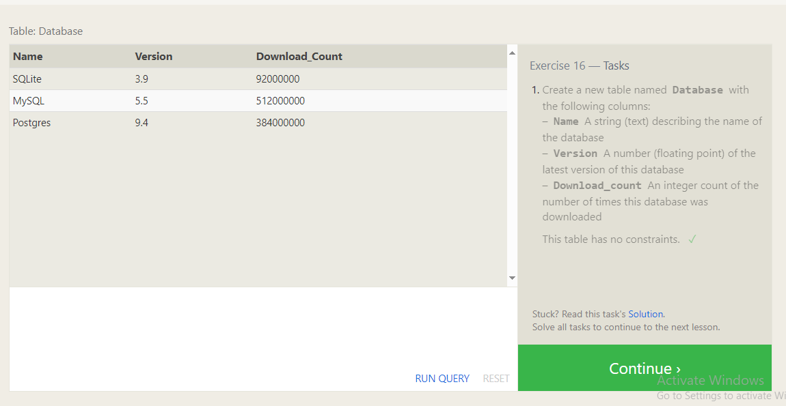
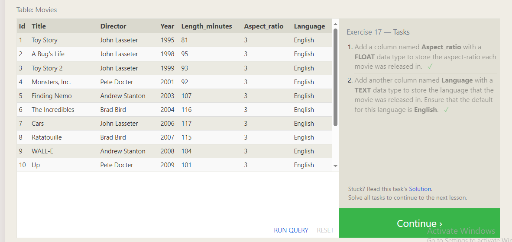
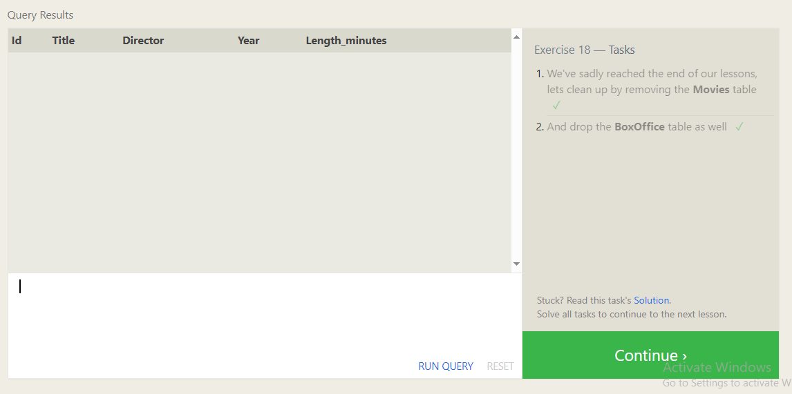
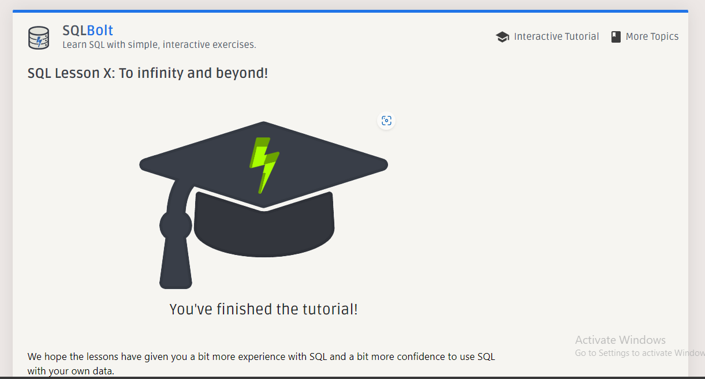

# Summary of SQL Lessons

This document provides a summary of my completion of all the SQL lessons.

## Introduction to SQL

> SQL(Structured Query Language) is a powerful tool for querying, manipulating, and transforming data stored in relational databases. These databases organize information into tables with fixed columns and variable rows, facilitating efficient data management and retrieval.

## SQL Lesson 1: SELECT queries

- **Summary**: Learned the basics of SELECT queries and how to retrieve data from a single table.

## SQL Lesson 2: Queries with constraints (Pt. 1)

.png)
- **Summary**: Explored how to filter query results using WHERE clause and various comparison operators.

## SQL Lesson 3: Queries with constraints (Pt. 2)

.png)
- **Summary**: Further advanced the understanding of filtering query results with complex conditions using AND, OR, and IN operators.

## SQL Lesson 4: Filtering and sorting Query results

- **Summary**: Learned about sorting query results using ORDER BY clause and filtering data using LIMIT clause.

## SQL Review: Simple SELECT Queries

- **Summary**: Reviewed the concepts of SELECT queries and practiced basic SQL commands.

## SQL Lesson 6: Multi-table queries with JOINs

- **Summary**: Explored how to perform queries involving multiple tables using INNER JOIN.

## SQL Lesson 13: Inserting rows

- **Summary**: Learned how to insert rows into a table using the INSERT statement.

## SQL Lesson 14: Updating rows

- **Summary**: Explored updating existing rows in a table using the UPDATE statement.

## SQL Lesson 15: Deleting rows

- **Summary**: Discussed deleting rows from a table using the DELETE statement.

## SQL Lesson 16: Creating tables

- **Summary**: Learned how to create new tables in a database using the CREATE TABLE statement.

## SQL Lesson 17: Altering tables

- **Summary**: Explored altering existing tables in a database using the ALTER TABLE statement.

## SQL Lesson 18: Dropping tables

- **Summary**: Discussed dropping tables from a database using the DROP TABLE statement.

## SQL Lesson X: To infinity and beyond!

